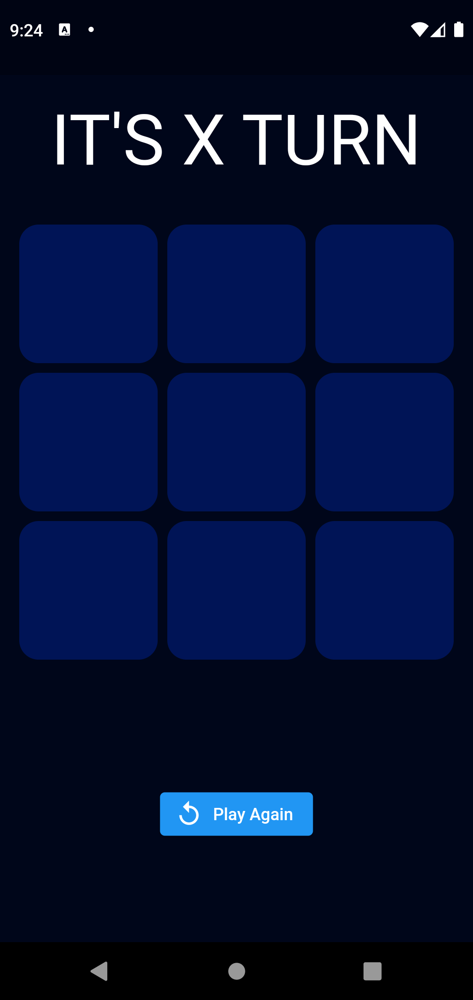
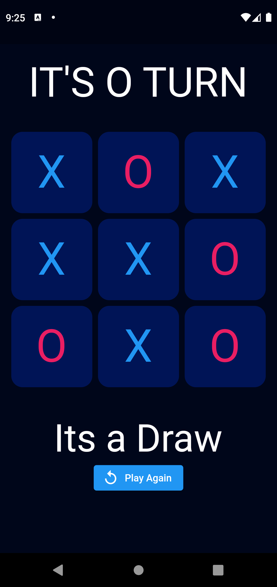
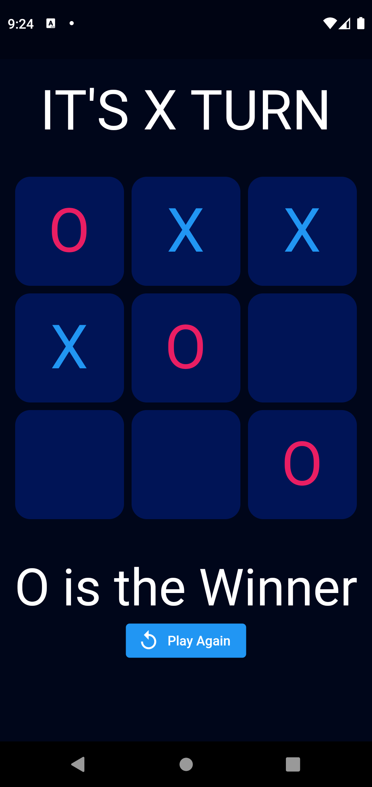
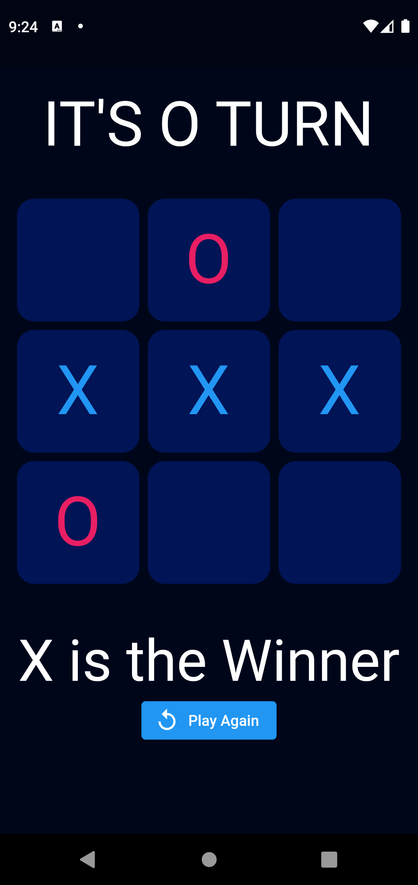

# Tic Tac Toe

A simple mobile game built with `Flutter`

[](https://github.com/SaiManojBotchu/TicTacToe)

Don't forget to give a star if you like this project 😅😊

> **Note**: This repository is still under development and I will continue to add more features to it! 🙃

## Table of Contents 📜

1. [General Info](#general-info-)
3. [Screenshots](#screenshots-)
4. [Getting Started](#getting-started-)
5. [Features](#features-)
6. [Technologies](#technologies-)
8. [Contact Me](#contact-me-)

## General Info 📝

The purpose of this project was to practice Flutter development by creating simple mobile game.

## Screenshots 📷

 &nbsp;&nbsp;&nbsp;&nbsp;  &nbsp;&nbsp;&nbsp;&nbsp;

 &nbsp;&nbsp;&nbsp;&nbsp;  &nbsp;&nbsp;&nbsp;&nbsp; 

## Getting Started 🚀

**1. [ Setup Flutter](https://flutter.io/setup/)**

**2. Clone the repo**

```sh
$ git clone https://github.com/KuntalGain/TicTacToe.git
$ cd TicTacToe/
```

**3. Install dependencies**
```sh
$ flutter pub get
```

**4. Run app**
```sh
$ flutter run
```

## Features ➕

**Current Features:**

1. Responsive UI.
2. Win score and draw score.
3. Reusability of code
4. Refresh Board

**Upcoming Features:**
1. Splash Screen.
2. Background music.
3. Game sounds.
4. User can change the name of players.
5. User can select his avatar.
6. Timer when playing game.
7. Minimal Animations.

## Technologies 👨🏻‍💻

[](https://flutter.dev/)   
[](https://dart.dev/)

## Contact Me 📞
**Kuntal Gain**

- Gmail: [@KuntalGain](mailto:Kuntalgain147@gmail.com)
- Twitter: [@KuntalGain](https://twitter.com/KuntalSDE)
- Github: [@KuntalGain](https://github.com/KuntalGain)
- LinkedIn: [@KuntalGain](https://www.linkedin.com/in/kuntal-gain-3385a9229/)
